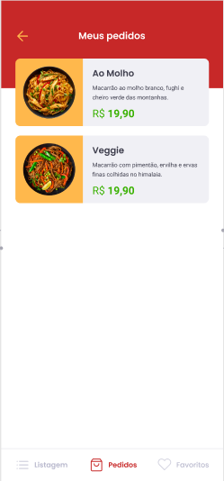

# GoRestaurant-Mobile

GoRestaurant is a mobile application that allows users to view, create, and update food dishes. The app provides an intuitive interface for managing restaurant menus and orders.

## Features

- **View Food Dishes**
  

- **Manage Orders**
  

## Technologies Used

- **React Native**: Framework for building mobile applications.
- **React Navigation**: Navigation library for React Native apps.
- **Styled Components**: Library for styling React components.
- **Axios**: HTTP client for making API requests.
- **Intl**: Internationalization library for formatting dates and numbers.
- **Jest**: Testing framework for ensuring code quality.

## Installation

To get started with GoRestaurant-Mobile, follow these steps:

1. **Clone the repository:**
   ```bash
   git clone <repository-url>
   cd GoRestaurant-Mobile
   ```

2. **Install dependencies:**
   ```bash
   npm install
   ```

3. **Run the app:**
   - For Android:
     ```bash
     npm run android
     ```
   - For iOS:
     ```bash
     npm run ios
     ```

4. **Start the development server:**
   ```bash
   npm start
   ```

## Development

- **Linting:** To lint the code, use:
  ```bash
  npm run lint
  ```

- **Testing:** To run tests, use:
  ```bash
  npm test
  ```
